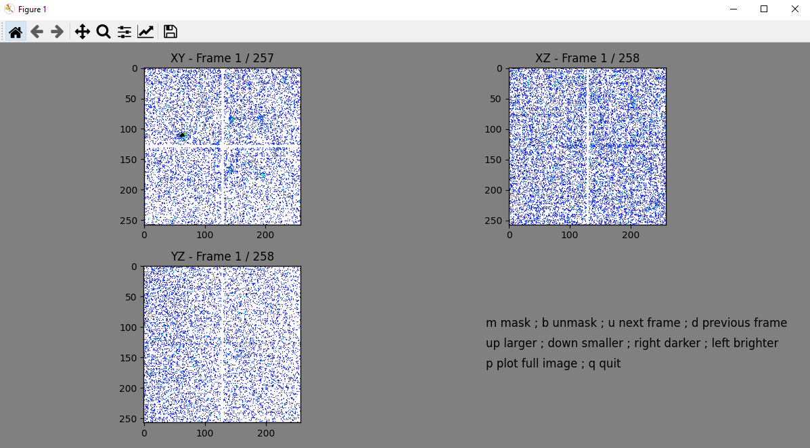
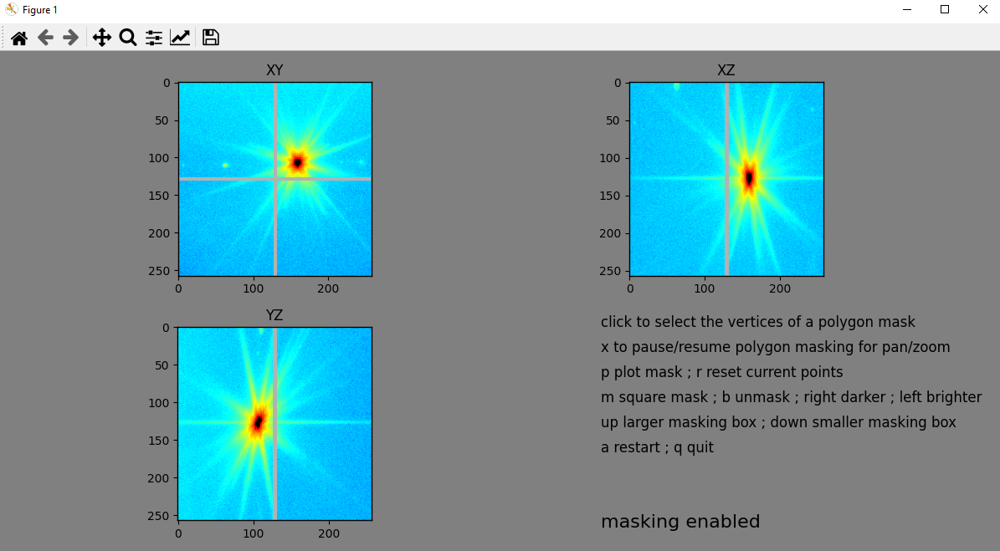
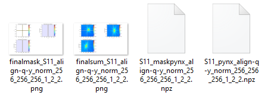

Example: preprocessing
----------------------

This example will guide you through the pre-processing of an experimental BCDI dataset
measured at the European Synchrotron Radiation Facility, beamline ID01.

The most usefull script is ``bcdi_preprocessing_BCDI.py``. It requires a YAML config
file, which for this example is ``bcdi/examples/S11_config_preprocessing.yml``.

In order to have it running correctly on your machine, you will have to modify the paths
for the following parameters::

    root_folder: "path_to/CXIDB-I182/CH4760/"
    save_dir: "path_to_saving_directory"
    data_dir: "path_to/CXIDB-I182/CH4760/S11/"

The script should run properly with other parameters unchanged.

After activating your virtual environment (assuming you created one, which is a good
practice), run:

``python path_to/bcdi_preprocessing_BCDI.py --conf path_to/S11_config_preprocessing.yml``

The data will be loaded and a plot is opened. This allows you to check whether, e.g.,
the region of interest provided is correct. Click on the plot to resume the execution
of the script.

After few plots, the window for interactive masking of parasitic intensities appears.
You can go through all 2D slices, mask or unmask pixels. A 3D mask is updating in
parallel, to be used during phase retrieval.

When you are done, type ``q`` when the mouse is over one the plots. The window closes,
and the program execution is resumed. After few other plots, you enter this time in the
interactive window for the projected data. You can use it typically to mask some hot
pixels if they are still present at this stage.

After masking the bad pixels, press again ``q`` when the mouse is over one of the plots.
The execution resumes and the final data and mask are saved. The plots of 2D slices
through the data and mask are also shown and saved.

