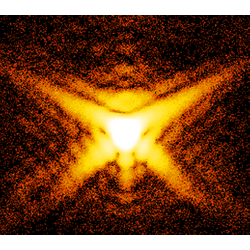

.. BCDI documentation main file, created by
   sphinx-quickstart on Wed Apr 24 10:57:29 2019.
   You can adapt this file completely to your liking, but it should at least
   contain the root `toctree` directive.

|bcdi icon| Welcome to BCDI's documentation!
============================================

.. toctree::
   :maxdepth: 2
   :caption: Contents:
    
.. include:: ../README.rst

Changelog
=========

.. include:: HISTORY.rst
  :end-before: Version 0.1.5

See the full  :doc:`Changelog<HISTORY>`

Command-line scripts
====================

Some sample scripts are provided with the package. However, the authors make no warranty
as to the correctness or accuracy of the analysis provided.

Documentation of the scripts included in BCDI.

.. toctree::
   :maxdepth: 1

   scripts/index.rst

API Documentation
=================

Documentation of the modules included in BCDI.

.. toctree::
   :maxdepth: 1

   modules/index.rst

Indices and tables
==================

* :ref:`genindex`
* :ref:`modindex`
* :ref:`search`
